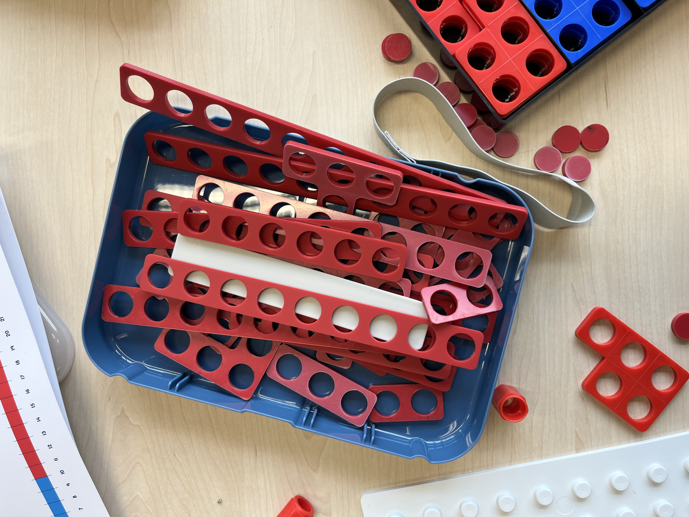
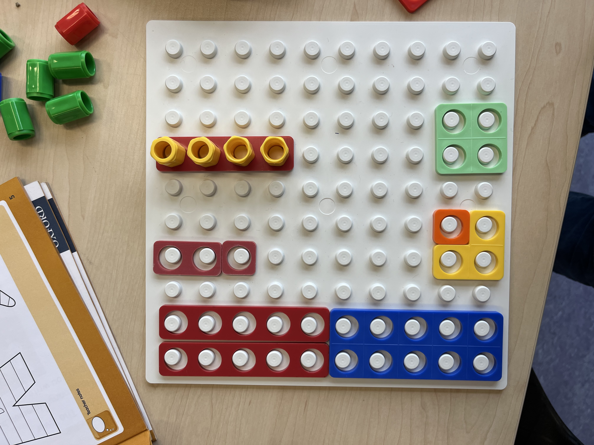

# Canvas Basic

## 1. Achtergrond
Onze missie zal zijn om ervoor te zorgen dat alle kinderen, ongeacht hun beperkingen, gelijke kansen krijgen om te leren en zich te ontwikkelen. Daarom zullen we de rekenkist blijven ontwikkelen, die attributen zal bevatten waarmee kinderen die op tast zijn aangewezen, in staat zullen zijn om de basisbeginselen van rekenen te leren: cijferbetekenis, optellen, aftrekken, vermenigvuldigen en delen.

Hoewel de rekenkist helaas moeilijk te verkrijgen of te bestellen is, zullen we blijven zoeken naar nieuwe methoden en materialen die kunnen worden gebruikt om deze vaardigheden aan te leren. Zo hebben we inmiddels ontdekt dat de Legobraillebricks-methode een speelse en holistische benadering biedt waarmee kinderen vaardigheden kunnen leren op het gebied van cognitie, emotie, fysiek, sociaal en creatief.

In de toekomst zullen we daarom 90 werkbladen blijven ontwikkelen, gebaseerd op materialen die makkelijk zelf te produceren zijn en die aansluiten bij de materialen die reeds aanwezig zijn. In plaats van een methode als leidraad te gebruiken, die vaak gebaseerd is op visuele en invuloefeningen, zullen we ervoor kiezen om op dezelfde leest geschoeid te zijn als Legobraillebricks, zodat kinderen op een speelse manier kunnen leren. Zo blijven we gelijke kansen bieden voor alle kinderen om hun rekenvaardigheden te ontwikkelen en te groeien.

## 2. Probleem/Uitdaging

## 3. Doelen

## 4. Resultaat

## 5. Afbakening 

## 6. Opdrachtgever
Bartiméus fonds en Bartiméus onderwijs.

## 7. Belanghebbenden

## 8. Projectteam

## 9. Aanpak:

### Fase 0: Idee

### Fase 1: Plannen en Voorbereiding

### Fase 2: Ontwerp en Ontwikkeling

### Fase 3: Testen en Evaluatie

### Fase 4: Lancering en Onderhoud

## 10. Risico's

## 11. Afhankelijkheden

## 12. Randvoorwaarden

## 13. Kwaliteit

## 14. Tijd

## 15. Geld

