# Materiaal
In kist zit het volgende materiaal. LEGObraillebricks en Tekenbord (tactile) zijn niet inbegrepen.

Wilt u dit materiaal bestellen dan kunt u dit doen met de volgende gegevens [bestelgegevens](bestelgegevens.md)

## Numicon
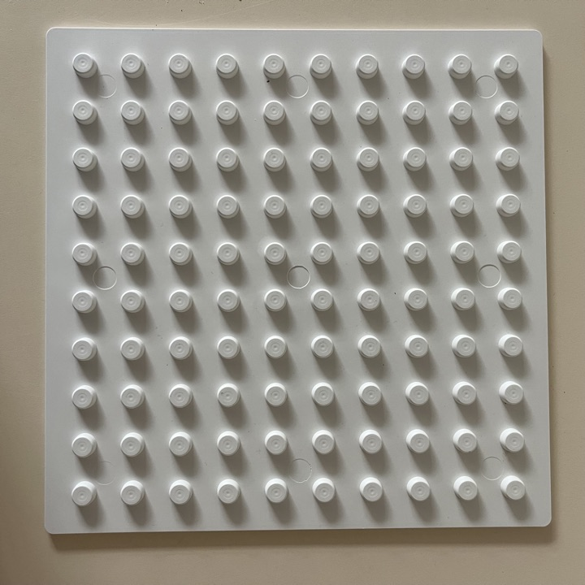

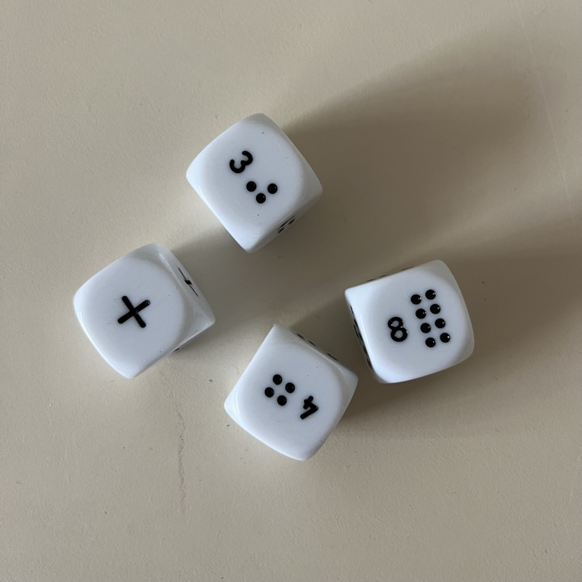
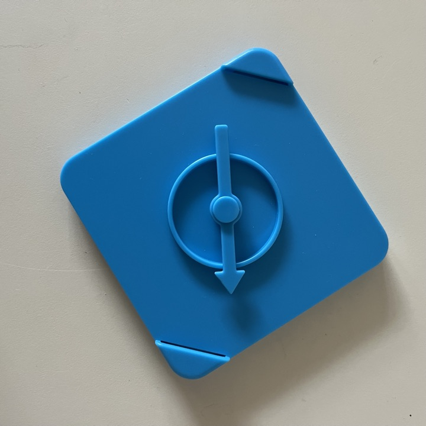

## TouchTile

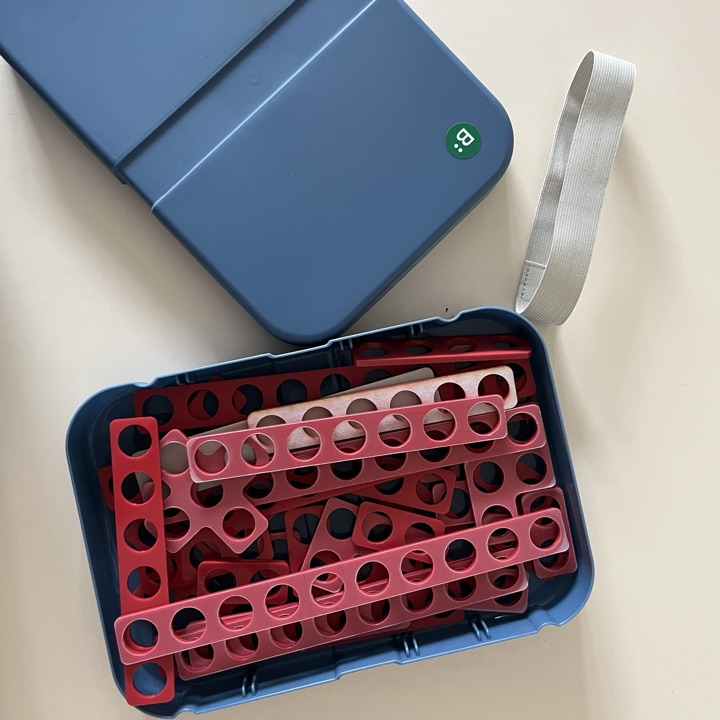
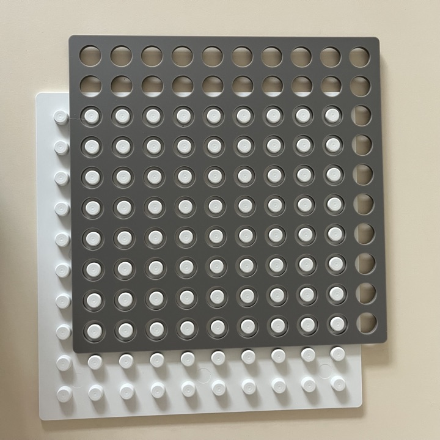
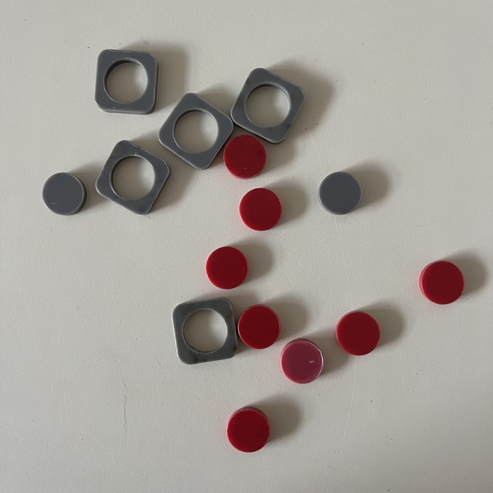
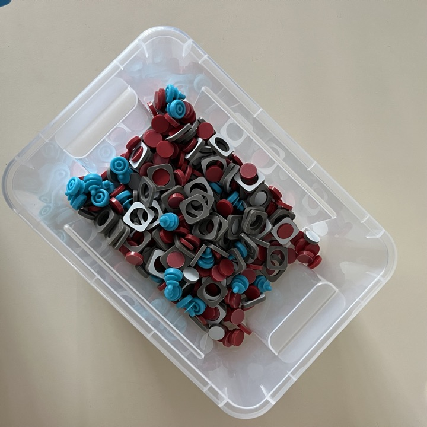

## MathLink Kube
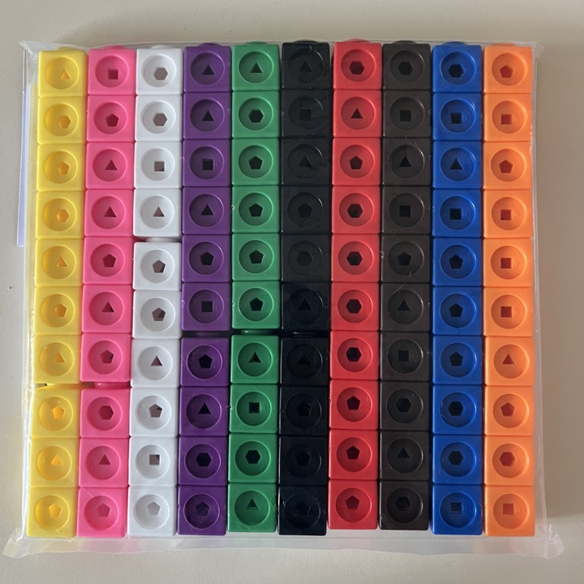

## MakeDo

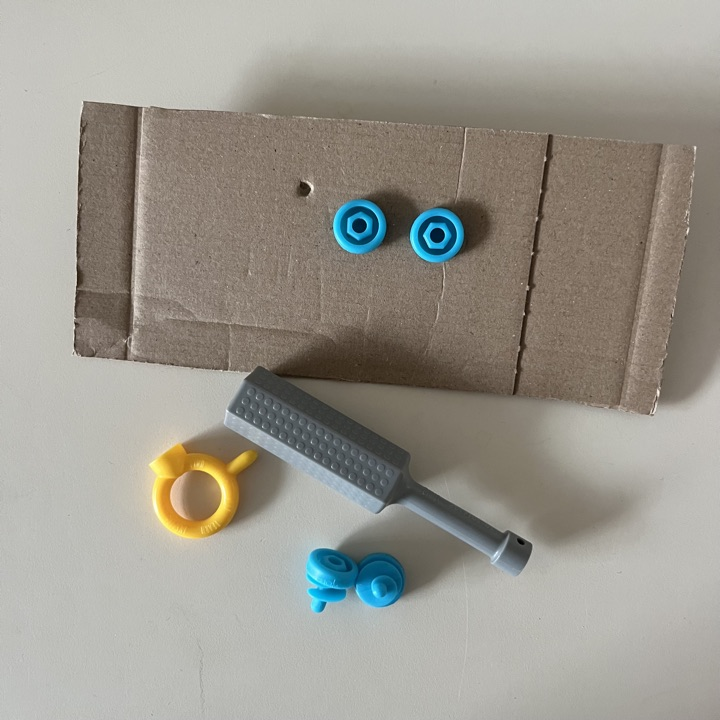
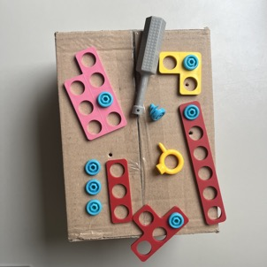

## Dobbelstenen
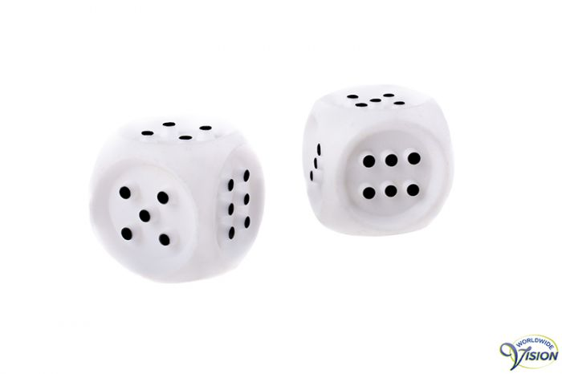

## LEGObraillebricks
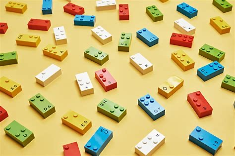

## Tekenbord

