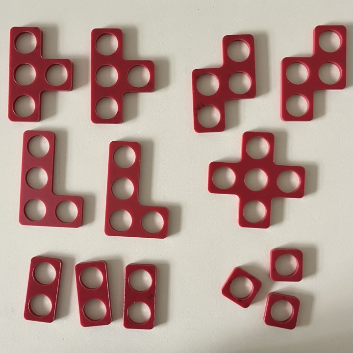

# Materiaal
In kist zit het volgende materiaal. LEGObraillebricks en Tekenbord (tactile) zijn niet inbegrepen.

Wilt u dit materiaal bestellen dan kunt u dit doen met de volgende gegevens [bestelgegevens](bestelgegevens.md)

## Numicon

## TouchTile

## MathLink Kube

## MakeDo

## Dobbelstenen

## LEGObraillebricks

## Tekenbord

