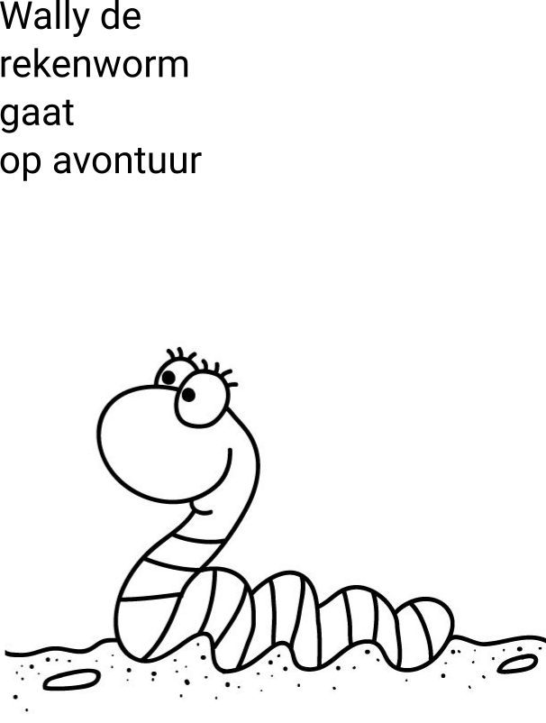
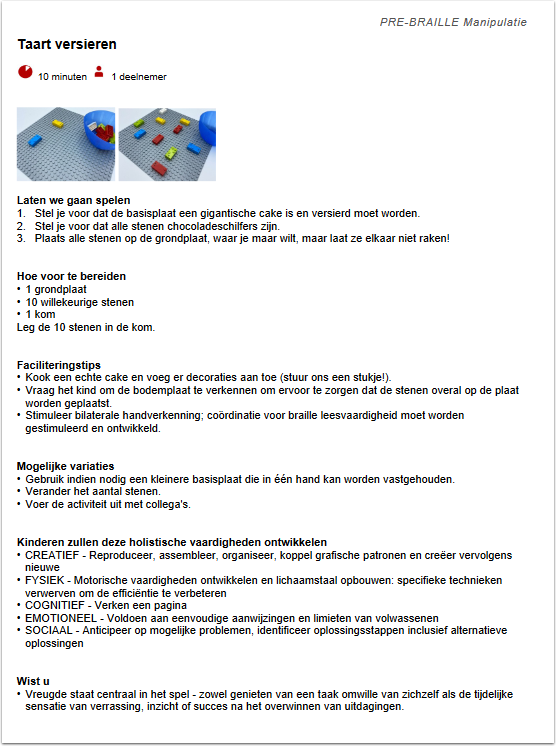

# Opzet Rekenworm

# Font
Roboto

# de hoofdrolspelers
Hier is een lijst van 10 tuindieren die u in het verhaal van de rekenworm kunt gebruiken:

1. Lieveheersbeestje
2. Sprinkhaan
3. Slak
4. Rups
5. Bij
6. Vlinder
7. Mier
8. Kikker
9. Spin
10. Hommel

U kunt deze dieren op creatieve wijze in het verhaal van de rekenworm opnemen, zodat Wally, de rekenworm, verschillende avonturen en ontmoetingen met deze tuindieren heeft. Elke ontmoeting kan een nieuw element van rekenen of getallen introduceren, waardoor het verhaal zowel leuk als leerzaam wordt.

De tuin is hierbij het bord

## verhaaltje voorbeeld

Er was eens een kleine, nieuwsgierige rekenworm genaamd Wally. Wally woonde in een gezellige tuin, omringd door bloemen en groenten. Op een zonnige dag besloot hij op avontuur te gaan en te leren rekenen.

Terwijl Wally door de tuin kronkelde, kwam hij een vriendelijk uitziend lieveheersbeestje tegen met één stip op haar rug. "Hallo, ik  Eentje," zei het lieveheersbeestje vrolijk. "Wil je me leren rekenen?" vroeg Wally. "Natuurlijk," antwoordde Eentje, "ik kan je leren wat één betekent. Eén bloem, één steen, één wolk, en zelfs één worm zoals jij!" Wally begon te glimlachen en begreep dat hij één stap dichter bij zijn doel was gekomen.

Wally vervolgde zijn avontuur en kwam al snel een vrolijke sprinkhaan tegen met twee lange antennes. "Hoi, ik ben Tweetje!" riep de sprinkhaan uit. "Zou je me kunnen leren wat twee betekent?" vroeg Wally nieuwsgierig. "Natuurlijk, kleine rekenworm!" zei Tweetje en wees op zijn antennes. "Kijk, ik heb twee antennes, twee ogen en twee potenben aan elke kant van mijn lichaam!" Wally luisterde aandachtig en besefte dat hij nu wist wat twee betekende.

Vol energie ging Wally verder en ontmoette een glimlachende slak met drie voelsprieten op zijn kop. "Ik ben Drietje," zei de slak langzaam. "Zou je me kunnen leren wat drie betekent?" vroeg Wally. Drietje knikte en legde uit: "Kijk, ik heb drie voelsprieten, en er zijn ook drie kleuren in een regenboog!" Wally was verbaasd over deze nieuwe informatie en bedankte Drietje hartelijk.

Ten slotte stuitte Wally op een mysterieus uitziende rups met een patroon van drieën op haar rug. "Ik ben Driemaal Drie," fluisterde de rups op geheimzinnige toon. Wally, nu vol vertrouwen, vroeg: "Kun je me leren wat drie keer drie is?" Driemaal Drie glimlachte en zei: "Drie keer drie is negen! Kijk naar mijn rug, er zijn drie groepen van drie stippen, en dat is negen in totaal." Wally was onder de indruk van wat hij had geleerd.

Na zijn ontmoetingen met zijn nieuwe vriendjes keerde Wally vol trots terug naar zijn huis in de tuin. Hij had niet alleen geleerd wat één, twee en drie betekenden, maar ook wat drie keer drie was. Vanaf die dag was Wally niet zomaar een worm meer; hij was een slimme rekenworm die klaar was om de wondere wereld van getallen te verkennen!

## Format
naar LEGO

**Domein**
**Titel**  

Tijd  
Aantal personen  

Laten we gaan spelen

Hoe voor te bereiden

Faciliteringstips

Mogelijke variaties

Kinderen zullen deze hollistische vaardigheden ontwikkelen

Wist u

## Spellen
